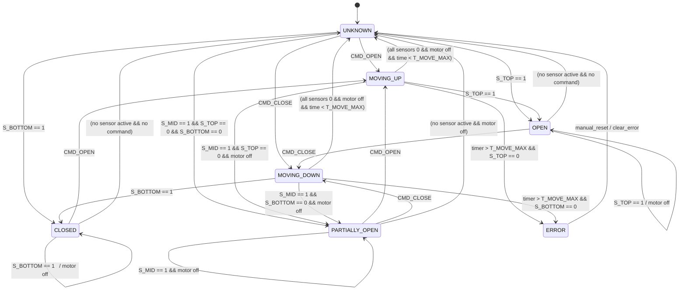

# garage_control – Garage Door Logic & State Machine

This module contains the **application logic specific to your garage**:

- Handling relays / GPIOs that open/close the door.
- Reading sensors (reed switches, limit switches, PIR, etc.).
- Managing an internal state machine:
  - UNKNOWN → OPENING → OPEN → CLOSING → CLOSED
- Timers & alarms (e.g. “door open for more than X minutes”).

# Garage Door State Machine

## States

- `UNKNOWN`           – no reliable position info (e.g. after power-on)
- `CLOSED`            – S_BOTTOM = 1
- `OPEN`              – S_TOP = 1
- `PARTIALLY_OPEN`    – S_MID = 1 (and not OPEN/CLOSED)
- `MOVING_UP`         – motor commanded to open
- `MOVING_DOWN`       – motor commanded to close
- `ERROR`             – movement timeout or inconsistent sensor readings

## Inputs

- Sensors:
  - `S_BOTTOM` (0/1)
  - `S_MID`    (0/1)
  - `S_TOP`    (0/1)
- Commands:
  - `CMD_OPEN`
  - `CMD_CLOSE`
  - `CMD_TOGGLE` (optional, if you emulate a single button)
- Timer:
  - `T_MOVE_MAX` (max allowed movement time)
  - `TICK` (periodic timer tick)

## State Diagram (mermaid, unrendered)



## Notes

  - On power-up:

    - If any sensor is active → jump directly to that state.
    - If none active → start in UNKNOWN.

  - While in MOVING_UP or MOVING_DOWN:

    - You start a movement timer.
    - If target sensor (S_TOP for open, S_BOTTOM for close) is not reached before T_MOVE_MAX → go to ERROR.

  - PARTIALLY_OPEN is any stable state with:

    - S_MID == 1 and S_TOP == 0 and S_BOTTOM == 0,
    - or no sensors active but last movement stopped early without error (implementation choice).


```c


typedef enum {
    GARAGE_STATE_UNKNOWN,
    GARAGE_STATE_OPEN,
    GARAGE_STATE_CLOSED,
    GARAGE_STATE_OPENING,
    GARAGE_STATE_CLOSING
} garage_state_t;

void garage_control_init(void);
void garage_control_command_open(void);
void garage_control_command_close(void);
void garage_control_command_toggle(void);

garage_state_t garage_control_get_state(void);
```

Interactions:

gpio_ctrl – low-level pin operations.

service_interface – provides HTTP endpoints for manual control.

mqtt – translates MQTT messages to commands and reports state.